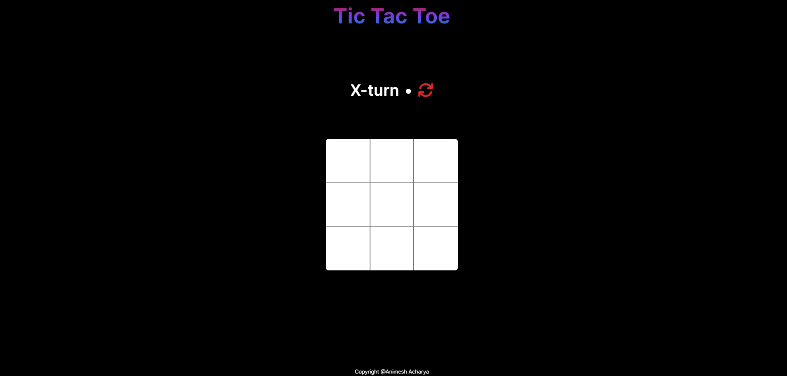

# Tic Tac Toe Game



## Table of Contents

- [Description](#description)
- [Demo](#demo)
- [Features](#features)
- [Installation](#installation)
- [Usage](#usage)
- [Contributing](#contributing)

## Description

This is a simple Tic Tac Toe game implemented in React. It provides a classic two-player experience and supports multiplayer mode. The game features a responsive design and an interactive interface.

## Demo

Check out the live demo [here](https://tictactoebyanimesh.vercel.app).

## Features

- Classic Tic Tac Toe gameplay
- Single-player against a bot or two-player mode
- Responsive design for various screen sizes
- Winning line visualization
- ...

## Installation

To run the Tic Tac Toe game locally, follow these steps:

1. Clone the repository:

   ```bash
   git clone https://github.com/AnimeshA867/tic-tac-toe.git
   ```

2. Navigate to the project directory:

   ```bash
   cd tic-tac-toe
   ```

3. Install dependencies:

   ```bash
   npm install
   ```

## Usage

After completing the installation, start the development server:

```bash
npm start
```

Visit [http://localhost:3000](http://localhost:3000) in your web browser to play the game.

## Contributing

Contributions are welcome! If you find any bugs or have suggestions for improvement, please open an issue or submit a pull request.
